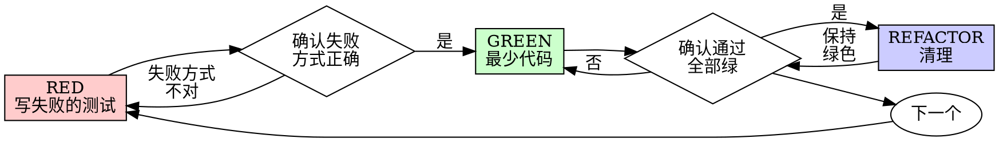

> 本文件是 [SKILL.md](./SKILL.md) 的中文同步版,仅供阅读参考。Agent 实际触发时读取的是 `SKILL.md`。两份文件冲突时以英文版为准。

# 测试驱动开发(TDD)

## 概述

先写测试。看着它失败。写最少的代码让它通过。

**核心原则:** 没有亲眼看到测试失败,你就不知道它测的是不是对的东西。

**违反规则的字面,就是违反规则的精神。**

## 何时使用

**永远:**
- 新功能
- Bug 修复
- 重构
- 行为变更

**例外(先问你的人类搭档):**
- 用完即弃的原型
- 生成的代码
- 配置文件

正在想"就这一次跳过 TDD"?停。那是合理化借口。

## 铁律

```
没有先失败的测试,就没有生产代码
```

先写了代码再写测试?删掉。重来。

**没有例外:**
- 不许留着"当参考"
- 不许一边写测试一边"改造"它
- 不许看它
- 删除就是删除

从测试出发重新实现。就这样。

## 红-绿-重构



### RED——写失败的测试

写一个最小的测试,表明应该发生什么。

<Good>
```typescript
test('retries failed operations 3 times', async () => {
  let attempts = 0;
  const operation = () => {
    attempts++;
    if (attempts < 3) throw new Error('fail');
    return 'success';
  };

  const result = await retryOperation(operation);

  expect(result).toBe('success');
  expect(attempts).toBe(3);
});
```
名字清晰,测真实行为,只测一件事
</Good>

<Bad>
```typescript
test('retry works', async () => {
  const mock = jest.fn()
    .mockRejectedValueOnce(new Error())
    .mockRejectedValueOnce(new Error())
    .mockResolvedValueOnce('success');
  await retryOperation(mock);
  expect(mock).toHaveBeenCalledTimes(3);
});
```
名字含糊,测的是 mock 不是代码
</Bad>

**要求:**
- 一个行为
- 名字清晰
- 真实代码(除非万不得已,不用 mock)

### 确认 RED——看着它失败

**强制。绝不跳过。**

```bash
npm test path/to/test.test.ts
```

确认:
- 测试是失败(不是报错)
- 失败信息符合预期
- 失败原因是功能缺失(不是拼写错误)

**测试直接通过了?** 你在测已有行为。改测试。

**测试报错了?** 修掉错误,重跑,直到它以正确的方式失败。

### GREEN——最少代码

写能让测试通过的最简单代码。

<Good>
```typescript
async function retryOperation<T>(fn: () => Promise<T>): Promise<T> {
  for (let i = 0; i < 3; i++) {
    try {
      return await fn();
    } catch (e) {
      if (i === 2) throw e;
    }
  }
  throw new Error('unreachable');
}
```
刚好够通过
</Good>

<Bad>
```typescript
async function retryOperation<T>(
  fn: () => Promise<T>,
  options?: {
    maxRetries?: number;
    backoff?: 'linear' | 'exponential';
    onRetry?: (attempt: number) => void;
  }
): Promise<T> {
  // YAGNI
}
```
过度设计
</Bad>

不要加功能、不要顺手重构别的代码、不要"改进"到测试要求之外。

### 确认 GREEN——看着它通过

**强制。**

```bash
npm test path/to/test.test.ts
```

确认:
- 测试通过
- 其他测试仍然通过
- 输出干净(没有报错、警告)

**测试失败?** 改代码,不是改测试。

**其他测试失败?** 现在就修。

### REFACTOR——清理

只在绿色之后:
- 去重
- 改进命名
- 提取辅助函数

保持测试绿色。不要添加行为。

### 重复

为下一个功能写下一个失败的测试。

## 好的测试

| 品质 | 好 | 坏 |
|---------|------|-----|
| **最小** | 只测一件事。名字里有"and"?拆开。 | `test('validates email and domain and whitespace')` |
| **清晰** | 名字描述行为 | `test('test1')` |
| **表明意图** | 演示期望的 API | 让人看不出代码该干什么 |

写测试或改测试时,读 [writing-good-tests.md](writing-good-tests.md),那里是让测试保持诚实的规则:
- 写测试之前,先说出"哪个生产代码改动会让这个测试失败"
- 断言真实行为,绝不断言 mock 的行为
- 仅测试用的代码放测试工具里,不放进生产类
- 弄清依赖的副作用之后再 mock 它

## 常见的合理化借口

| 借口 | 现实 |
|--------|---------|
| "太简单,不用测" | 简单代码也会坏。测试只要 30 秒。 |
| "我之后会补测试" | 事后写的测试一跑就过——这什么也证明不了。它可能测错了东西、测的是实现而不是行为、漏掉你忘了的边界情况。你从没看它失败过,所以从没证明过它能抓住 bug。先写测试逼出那次失败。 |
| "事后测试达到同样目的(重精神不重仪式)" | 事后的测试回答"这代码做了什么";事先的测试回答"这代码应该做什么"。事后的测试被你已写的代码带了偏——你验证的是你记得的用例,不是本来会发现的用例。只有覆盖率,没有测试有效的证明。 |
| "我已经手工测过了" | 手工测试是临时起意的:没有覆盖记录、代码改了没法重跑、压力之下容易漏用例。"我试的时候是好的" ≠ 全面。自动化测试每次都以同样的方式运行。 |
| "删掉 X 小时的成果太浪费" | 沉没成本谬误——那些时间反正已经花了。真正的选择是:用 TDD 重写(高置信)vs 留着它事后补测试(低置信,大概率有 bug)。留着一份你无法信任的代码才是浪费。 |
| "留作参考,先写测试" | 你会去改造它。那就是事后测试。删除就是删除。 |
| "我需要先探索" | 可以。探索的代码扔掉,然后从 TDD 开始。 |
| "测试难写 = 还没想清楚" | 听测试的。难测 = 难用。 |
| "TDD 会拖慢我" | TDD 才是务实路线:提交前抓住 bug、防回归、让你无所畏惧地重构。"务实"的捷径意味着在生产环境调试——更慢,不是更快。 |
| "手工测更快" | 手工证明不了边界情况。而且每次改动你都得重测一遍。 |
| "现有代码本来就没测试" | 你正在改进它。给现有代码补上测试。 |

## 红色警报——停下,重来

- 先写了代码再写测试
- 实现之后才写测试
- 测试一次就通过
- 说不清测试为什么失败
- 测试"以后再补"
- 正在合理化"就这一次"
- "我已经手工测过了"
- "事后测试达到同样目的"
- "重要的是精神不是仪式"
- "留作参考"或"改造现有代码"
- "已经花了 X 小时,删掉太浪费"
- "TDD 太教条,我这是务实"
- "这次不一样,因为……"

**以上任何一条都意味着:删掉代码。用 TDD 重来。**

## 示例:修 Bug

**Bug:** 空邮箱被接受了

**RED**
```typescript
test('rejects empty email', async () => {
  const result = await submitForm({ email: '' });
  expect(result.error).toBe('Email required');
});
```

**确认 RED**
```bash
$ npm test
FAIL: expected 'Email required', got undefined
```

**GREEN**
```typescript
function submitForm(data: FormData) {
  if (!data.email?.trim()) {
    return { error: 'Email required' };
  }
  // ...
}
```

**确认 GREEN**
```bash
$ npm test
PASS
```

**REFACTOR**
如有需要,为多个字段提取统一的校验逻辑。

## 验证清单

宣布工作完成之前:

- [ ] 每个新函数/方法都有测试
- [ ] 每个测试都在实现前看着它失败过
- [ ] 每个测试的失败原因都符合预期(功能缺失,不是拼写错误)
- [ ] 每个测试都只写了最少代码去通过
- [ ] 所有测试通过
- [ ] 输出干净(没有报错、警告)
- [ ] 测试用的是真实代码(mock 仅限万不得已)
- [ ] 边界情况和错误路径有覆盖

有勾不上的?你跳过了 TDD。重来。

## 卡住时

| 问题 | 解法 |
|---------|----------|
| 不知道怎么测 | 先写你希望存在的 API。先写断言。问你的人类搭档。 |
| 测试太复杂 | 设计太复杂。简化接口。 |
| 什么都得 mock | 代码耦合太紧。用依赖注入。 |
| 测试准备工作巨大 | 提取辅助函数。还是复杂?简化设计。 |

## 与调试的衔接

发现 bug?先写一个复现它的失败测试,然后走 TDD 循环。这个测试既证明修复有效,又防止回归。

绝不在没有测试的情况下修 bug。

## 最终规则

```
生产代码 → 存在对应测试,且它先失败过
否则 → 不是 TDD
```

没有你的人类搭档的允许,没有例外。
