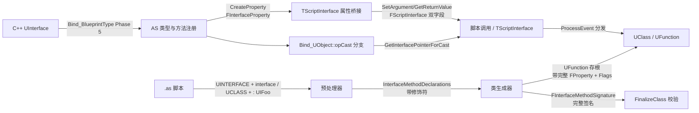

## 产品概述

对 Angelscript 插件的接口（UInterface）系统进行一次系统性补齐，让脚本侧的接口用法在语义与书写体验上尽可能贴近 C++ UInterface 的典型用法，解决当前"脚本接口看起来像 C++，但关键能力缺失"导致的使用一致性问题。

命名约定维持现状（脚本定义接口保留 `UI` 双字前缀，C++ 接口仍以 `U` 前缀 UClass 名引用），不做破坏性重命名；本次改动全部以新增能力 + 现有机制增强的方式落地。

## 核心功能

1. **接口方法签名完整校验**

- 将 `FInterfaceMethodSignature` 从仅 `FName` 升级为含参数类型链与返回值的完整签名。
- `FinalizeClass` 的方法存在性校验从"同名"升级为"同名 + 参数数量 + 参数类型 + const 限定 + 返回值"全匹配。
- `DoFullReloadClass` 生成的接口 UFunction 存根补齐完整 `FProperty` 链，新建类与 Full Reload 两条路径行为一致。

2. **TScriptInterface<I> 属性与参数桥接**

- 脚本中可声明 `UPROPERTY() TScriptInterface<UIFoo> MyRef`、`UFUNCTION void Foo(TScriptInterface<UIFoo> Ref)`。
- 跨 UE 反射边界（属性读写、反射调用参数/返回值）正确通过 `FScriptInterface` 的 `ObjectPointer + InterfacePointer` 双字段传递，自动调用 `UObject::GetInterfaceAddress(InterfaceClass)`。
- 纯脚本接口与 C++ UInterface 统一支持。

3. **C++ 实现类的接口指针偏移修复**

- `Bind_UObject.cpp` 的 opCast 接口分支、`TScriptInterface` 桥接、`CallInterfaceMethod` 的 this 指针传递全部改走 `UObject::GetInterfaceAddress(InterfaceClass)`。
- 脚本中 `Cast<UAngelscriptNativeParentInterface>(NativeActor)` 在 C++ 实现类（非 `PointerOffset = 0`）场景下拿到正确的接口指针偏移。

4. **接口方法事件语义（BlueprintNativeEvent / BlueprintImplementableEvent）**

- 预处理器保留接口块内 `UFUNCTION()` 修饰符并记录到方法描述。
- 接口 UFunction 存根按修饰符设置 `FUNC_BlueprintEvent` / `FUNC_Native` / `FUNC_BlueprintPure` 等 flags。
- 脚本类实现 `BlueprintNativeEvent` 接口方法的行为对齐 C++ 的 `_Implementation` 派发语义，C++ 侧 `Execute_XXX` 调用能命中脚本实现（不在脚本侧提供 `Execute_XXX` 语法糖，仅保证分发语义一致）。

5. **Obj.Implements<T>() 泛型查询**

- 在 AS 脚本层新增模板化调用：`Obj.Implements<UIFoo>()`，等价于 `Obj.ImplementsInterface(UIFoo::StaticClass())`。
- 脚本声明接口与 C++ 接口统一可用；保留现有 `ImplementsInterface(UClass)` 形式向后兼容。

6. **测试与文档闭环**

- 新增不少于 15 个自动化测试，覆盖上述 5 个能力的正/负例与 C++ 双指针 Regression。
- 现有 36+ 个接口测试全部回归通过，`Documents/Knowledges/InterfaceBinding.md` 能力矩阵、`Documents/Plans/Plan_InterfaceBinding.md` 状态、`AngelscriptChange.md` 同步更新。

## 验收标准

- 5 个痛点的能力矩阵在知识文档中由"未支持/部分支持"变为"已支持"或"明确延后"。
- 新增 ≥15 个接口测试通过，现有 36+ 接口测试零回归。
- `TScriptInterface<UIFoo>` 属性/参数在脚本与 C++ 之间能正确双向传递，C++ native 接口实现类的 Cast 指针偏移正确。
- 接口方法签名在参数/返回值层面完整校验，接口块的 `BlueprintNativeEvent` 修饰符生效并产生正确的 UFunction flags。
- 所有 ThirdParty 修改通过 `//[UE++]` / `//[UE--]` 标记，并在 `AngelscriptChange.md` 登记；`AngelscriptForkStrategy.md` 中记录与 AS 2.38 的兼容策略。

## 技术栈

- **语言 / 平台**：UE5 插件（`Plugins/Angelscript`），C++（UE 反射）+ AngelScript（脚本层）
- **ThirdParty**：AngelScript 2.33 + 选择性 2.38（`Documents/Guides/AngelscriptForkStrategy.md`），本 Plan 允许在 `Plugins/Angelscript/Source/ThirdParty/AngelScript/source/` 内加 `//[UE++]` / `//[UE--]` 标记修改
- **测试框架**：UE Automation Test，测试路径 `Angelscript.TestModule.Interface.*` / `Angelscript.TestModule.CppInterface.*`
- **构建入口**：`Tools\RunBuild.ps1`、`Tools\RunTests.ps1`、`Tools\RunTestSuite.ps1`

## 实施策略

本 Plan 以"插件层为主、ThirdParty 为辅"的增量增强路径落地，**不改变**现有接口命名约定（保留 `UI` 双字前缀），**不切换**到 AS 原生 `interface` 关键字（`as_tokendef.h` 不改动），把 AS 2.38 合并风险控制在最小。

关键技术决策：

1. **签名升级走"数据结构扩展 + 校验路径升级"两步法**：先把 `FInterfaceMethodSignature` 从 `FName` 扩展为 `{FName, TArray<FAngelscriptTypeUsage> ParamTypes, FAngelscriptTypeUsage ReturnType, uint8 FunctionFlags}`，再把 `FinalizeClass` 的同名匹配升级为签名匹配。Full Reload 与新建类两条路径共用同一份签名生成函数，避免双重维护。

2. **双指针布局修复收敛到单个助手函数**：在 `Bind_Helpers.h` 增加 `GetInterfacePointerForCast(UObject* Object, UClass* InterfaceClass) -> void*`，所有接口相关写入点（opCast、`CallInterfaceMethod` 的 this 装载、TScriptInterface 的 `SetInterface`）统一调用，避免散落的 `*(UObject**)OutAddress = Object` 导致的偏移遗漏。脚本类 `PointerOffset == 0` 时行为与现状完全一致，C++ 原生实现类走 `GetInterfaceAddress` 分支。

3. **TScriptInterface 桥接复用 Patch 方案的分层模式**：

- `FUObjectType::CreateProperty`：对 `CLASS_Interface` 的 UClass 生成 `FInterfaceProperty` 而非 `FObjectProperty`。
- `FUObjectType::MatchesProperty`：识别 `FInterfaceProperty` 并校验 `InterfaceClass`。
- `FUObjectType::SetArgument / GetReturnValue`：通过 `FScriptInterface` 桥接（`SetObject` + `SetInterface(GetInterfaceAddress)`），读路径用 `GetObject()`。
- `BindProperty`：生成 Get/Set 访问器，Setter 里做 `ImplementsInterface` 校验。
- TypeFinder 扩展：`CastField<FInterfaceProperty>` → `FAngelscriptTypeUsage::FromClass(InterfaceClass)`，让 C++ 侧 `TScriptInterface<IFoo>` 属性自动映射到 AS 接口类型。

4. **BlueprintNativeEvent 支持采用"修饰符透传 + UFunction flags 设置"**：

- 预处理器：在 `ParseInterfaceBody` 里不再丢弃 `UFUNCTION(...)`，把修饰符字符串和解析结果连同方法声明一起挂到 `FInterfaceMethodDeclaration`。
- 类生成器：`DoFullReloadClass` 和新建路径在生成 UFunction 存根时，按修饰符设置 `FUNC_BlueprintEvent`、`FUNC_Native`、`FUNC_BlueprintPure`、`FUNC_Const` 等 flags；对 `BlueprintNativeEvent` 生成额外的 `_Implementation` 方法链（若需要）。
- 反射调用路径：接口的 BlueprintNativeEvent 方法在 `CallInterfaceMethod` 里通过 `ProcessEvent` 走，UE 的反射层自动处理脚本 override 与 C++ `_Implementation` 的分发，脚本侧无需额外语法糖。

5. **`Obj.Implements<T>()` 走 AS 模板函数 + 运行时解析**：

- 在 `Bind_UObject.cpp` 注册一个泛型方法（参考 AS 的 `funcdef` + `GetObjectType` 机制），`Implements<T>()` 在编译期拿到 `T` 的 `asITypeInfo` 对应的 `UClass*`，运行时复用 `UObject::ImplementsInterface(UClass)`。
- 若 AS 原生模板注册能力不足，可在预处理器层做语法糖替换：`Obj.Implements<UIFoo>()` → `Obj.ImplementsInterface(UIFoo::StaticClass())`（现有 `Cast<T>()` 已在预处理器/AS 模板层有范式可参考）。优先走 AS 模板注册，不行再降级到预处理器语法糖。

6. **ThirdParty 修改最小化**：

- 评估是否需要启用 `as_objecttype.cpp` 的 `IsInterface()`（Phase 0 决策），若启用则仅此一处，纳入 `AngelscriptChange.md`。
- 不启用 `as_tokendef.h` 的 `interface` 关键字、不改 `as_builder.cpp`（保持与 2.38 升级的合并面最小）。
- 已有的 `CanCastScriptObjectToUnrealInterface` 三处注入保持不动。

## 性能与可靠性

- **签名校验热点**：`FinalizeClass` 每次 Full Reload 都会走，升级后校验复杂度从 O(N 名字比较) 升为 O(N × M 参数比较)。预期 N/M 均在十量级，不构成热点；用 `TMap<FName, FInterfaceMethodSignature*>` 预索引避免二重循环。
- **接口 Cast 热点**：`GetInterfacePointerForCast` 对脚本实现类走 `PointerOffset == 0` 快路径返回 `Object` 本身，C++ 实现类才走 `GetInterfaceAddress(InterfaceClass)`（UE 内部是一次 `TArray<FImplementedInterface>` 线性扫描），与 UE 原生 `Cast<IFoo>()` 同阶，无额外开销。
- **TScriptInterface 属性访问**：Get/Set 访问器在 `BindProperty` 阶段一次性生成，运行时没有反射查找开销。

## 日志与回归控制

- 所有新增校验失败、接口偏移异常走现有 `UE_LOG(LogAngelscript, Warning/Error, ...)`，避免新 Logger；对接口签名不匹配给出"期望签名 vs 实际签名"的可读对比输出。
- `FinalizeClass` 的签名校验保留"旧存根无 FProperty 链时跳过"的降级路径，保证首次升级不会让现有脚本编译失败。
- TScriptInterface 的 Setter 在接口不匹配时走 `ensure` + 返回不赋值，而不是 `check` 崩溃。
- 每个 Phase 末尾独立 Git 提交 + 单独运行接口全集回归；Phase 2 双指针修复前先补针对性 Regression 测试，再改实现，避免回归。

## 架构设计

现有三层架构保持不变，本 Plan 在每一层做定点增强：



## 目录结构

```
AngelscriptProject/
├── Documents/
│   ├── Plans/
│   │   ├── Plan_InterfaceParityWithCpp.md                       # [NEW] 本 Plan 文档，含决策、Phase、验收、风险
│   │   └── Plan_InterfaceBinding.md                             # [MODIFY] 更新状态，标注与本 Plan 的承接关系
│   └── Knowledges/
│       └── InterfaceBinding.md                                  # [MODIFY] 能力矩阵前后对比、修复 5 个已知限制中的 3 个
├── Plugins/Angelscript/
│   ├── AngelscriptChange.md                                     # [MODIFY] 若启用 as_objecttype.cpp::IsInterface() 则登记
│   └── Source/
│       ├── AngelscriptRuntime/
│       │   ├── Preprocessor/
│       │   │   ├── AngelscriptPreprocessor.h                    # [MODIFY] FInterfaceMethodDeclaration 增加修饰符字段与签名字段
│       │   │   └── AngelscriptPreprocessor.cpp                  # [MODIFY] 接口块内 UFUNCTION() 不再丢弃；方法签名提取完整参数类型；Obj.Implements<T>() 降级语法糖（若需要）
│       │   ├── Core/
│       │   │   ├── AngelscriptEngine.h                          # [MODIFY] FInterfaceMethodSignature 升级为含 ParamTypes/ReturnType/Flags
│       │   │   └── AngelscriptEngine.cpp                        # [MODIFY] RegisterInterfaceMethodSignature 对齐新结构，签名释放路径更新
│       │   ├── ClassGenerator/
│       │   │   └── AngelscriptClassGenerator.cpp                # [MODIFY] CallInterfaceMethod 的 this 指针走 GetInterfacePointerForCast；FinalizeClass 升级签名匹配；DoFullReloadClass 生成完整 FProperty 链 + FUNC_* flags；接口存根按修饰符构建
│       │   └── Binds/
│       │       ├── Bind_Helpers.h                               # [MODIFY] 新增 GetInterfacePointerForCast、GetInterfaceObjectFromProperty、SetInterfaceObjectFromProperty、GetValueFromPropertyGetter_InterfaceHandle、SetInterfaceObjectFromPropertySetter
│       │       ├── Bind_UObject.cpp                             # [MODIFY] opCast 接口分支走 GetInterfacePointerForCast；ImplementsInterface(UClass) 保持；新增 Implements<T>() 模板方法注册
│       │       └── Bind_BlueprintType.cpp                       # [MODIFY] FUObjectType::CreateProperty/MatchesProperty/SetArgument/GetReturnValue/BindProperty 扩展 FInterfaceProperty 分支；TypeFinder 识别 FInterfaceProperty
│       ├── AngelscriptTest/
│       │   ├── Interface/
│       │   │   ├── AngelscriptInterfaceSignatureTests.cpp       # [NEW] 签名校验正/负例（参数数量/类型/返回值/const 不匹配）
│       │   │   ├── AngelscriptInterfacePropertyTests.cpp        # [NEW] TScriptInterface<UIFoo> 属性 Get/Set/Null/越界赋值正/负例
│       │   │   ├── AngelscriptInterfaceArgumentTests.cpp        # [NEW] TScriptInterface<UIFoo> 作为 UFUNCTION 参数/返回值的反射调用闭环
│       │   │   ├── AngelscriptInterfaceNativePointerOffsetTests.cpp # [NEW] C++ 实现类 Cast 接口后调用行为正确（双指针）
│       │   │   ├── AngelscriptInterfaceBlueprintEventTests.cpp  # [NEW] BlueprintNativeEvent / BlueprintImplementableEvent 修饰符行为
│       │   │   └── AngelscriptInterfaceImplementsGenericTests.cpp # [NEW] Obj.Implements<UIFoo>() 泛型查询正/负例，脚本与 C++ 接口统一
│       │   └── Shared/
│       │       ├── AngelscriptNativeInterfaceTestTypes.h        # [MODIFY] 增加 TScriptInterface<IAngelscriptNativeParentInterface> 属性 fixture；C++ 实现类带非零 PointerOffset 的复合继承
│       │       └── AngelscriptNativeInterfaceTestTypes.cpp      # [MODIFY] 实现补齐
│       └── ThirdParty/AngelScript/source/
│           └── as_objecttype.cpp                                # [MODIFY?] Phase 0 决策：若启用 IsInterface()，加 //[UE++]/[UE--] 标记
└── Script/Examples/Extended/
    ├── Example_ScriptInterface.as                               # [MODIFY] 增加 TScriptInterface<UIFoo> 属性示例、Implements<T>() 示例
    └── Example_InterfaceBlueprintEvent.as                       # [NEW] BlueprintNativeEvent 接口方法脚本实现 + C++ 调用示例
```

## 关键结构（仅列必要接口）

```cpp
// Core/AngelscriptEngine.h — 升级后的接口方法签名
struct FInterfaceMethodSignature
{
    FName FunctionName;
    TArray<FAngelscriptTypeUsage> ParamTypes;   // 新增：完整参数类型链
    FAngelscriptTypeUsage         ReturnType;   // 新增：返回类型
    uint32 FunctionFlags;                       // 新增：FUNC_BlueprintEvent / FUNC_Native / FUNC_Const / FUNC_BlueprintPure
    bool   bIsConst;                            // 新增：const 限定
};

// Binds/Bind_Helpers.h — 双指针桥接统一入口
void* GetInterfacePointerForCast(UObject* Object, UClass* InterfaceClass);
// 脚本实现类（PointerOffset == 0）→ 返回 Object
// C++ 原生实现类 → 返回 Object->GetInterfaceAddress(InterfaceClass)
// InterfaceClass 非 CLASS_Interface 或 Object 未实现 → 返回 nullptr
```

## Agent Extensions

### SubAgent

- **code-explorer**
- Purpose: 深入探查 `Preprocessor`、`ClassGenerator`、`Bind_BlueprintType.cpp` 的现有接口相关实现细节，对照 `Reference/` 下的 UnrealCSharp / Patch 方案确认 TScriptInterface / FInterfaceProperty / 双指针桥接的具体改造锚点，避免规划阶段遗漏。
- Expected outcome: 输出确认过的修改靶点清单（函数名、行号、调用链），用于 Phase 1~5 实施时直接定位。

### MCP

- **knot / UE5-main (git_iwiki)**
- Purpose: 查询 UE 内部 `FScriptInterface::SetInterface`、`UObject::GetInterfaceAddress`、`FInterfaceProperty::CopyCompleteValueFromScriptVM` 等 API 在 ue5-main 的当前实现与语义约束，确保双指针桥接与 Native 实现类分发完全贴合引擎契约。
- Expected outcome: 为 Phase 2（双指针修复）和 Phase 3（TScriptInterface 桥接）提供权威 API 行为依据，避免猜测实现。
- **knot / UE-Angelscript (git)**
- Purpose: 检索 myas 仓库中接口相关的历史实现片段（`CallInterfaceMethod`、`ResolveInterfaceClass`、`AddInterfaceRecursive`、`FinalizeClass` 校验逻辑）作为横向参考。
- Expected outcome: 为 Phase 1 签名升级和 Phase 4 事件语义改造提供可对照的实现参考。