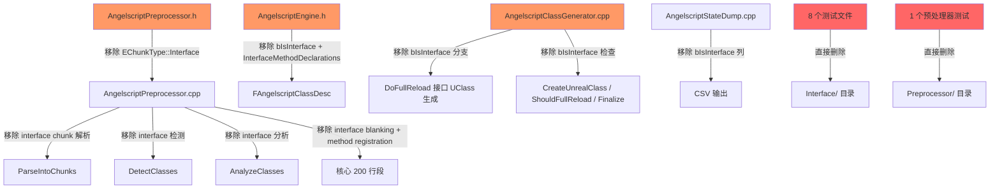

## 用户需求

移除 AngelScript 脚本中"定义新接口"（`UINTERFACE()` + `interface UIFoo {}`）的全部支持代码和测试，但保留"实现 C++ 已有接口"的能力。

## 产品概述

AngelScript 脚本语言插件不再允许用户在 `.as` 脚本中声明新的 UInterface，与 Hazelight 官方、UnLua、puerts 等主流 UE 脚本方案保持一致。脚本类仍可通过继承列表声明实现 C++ 原生接口（如 `class A : AActor, UCppInterface`），Cast、方法调用、C++ Execute_ 桥接等能力不受影响。

## 核心特性

- 移除预处理器中 `interface` 关键字识别、`EChunkType::Interface` 枚举及所有 interface chunk 处理逻辑
- 移除 `FAngelscriptClassDesc` 中 `bIsInterface` / `InterfaceMethodDeclarations` 字段及相关比较
- 移除 ClassGenerator 中脚本接口 UClass 生成、UFunction 创建、接口方法注册的完整分支
- 删除 8 个测试脚本接口的 C++ 测试文件 + 1 个预处理器接口测试文件
- 保留全部 C++ 原生接口实现能力：Cast、ImplementsInterface、ImplementedInterfaces 解析、Bind_BlueprintType Phase 5 自动绑定、指针偏移修复
- 更新 StateDump CSV 输出移除 `bIsInterface` 列
- 更新 InterfaceBinding 知识文档同步变更

## 技术栈

- C++ (UE5 插件模块: AngelscriptRuntime / AngelscriptTest)
- PowerShell 构建/测试脚本

## 实现方案

**策略**: 分层移除 — 先删测试文件（爆破面最小），再从外层（ClassGenerator）到内层（Preprocessor）逐步清除运行时代码，最后更新数据结构和文档。每步可独立编译验证。

**关键技术决策**:

1. `EChunkType::Interface` 枚举值直接移除（所有引用点同步清理）
2. `bIsInterface` 字段从 `FAngelscriptClassDesc` 完全移除（不保留为 `false` 默认值），因为该字段仅服务于脚本定义的接口类；C++ 原生接口通过 `UClass::HasAnyClassFlags(CLASS_Interface)` 判断
3. `InterfaceMethodDeclarations` 数组完全移除 — 仅被预处理器填充和 ClassGenerator 消费，C++ 接口方法注册走 `Bind_BlueprintType` Phase 5 独立路径
4. `ImplementedInterfaces` 数组和解析逻辑**保留** — 脚本类 `class A : AActor, UCppInterface` 依赖此路径
5. `CallInterfaceMethod` 泛型调度器、`FInterfaceMethodSignature`、`RegisterInterfaceMethodSignature` / `ReleaseInterfaceMethodSignature` **保留** — C++ 接口绑定（Bind_BlueprintType Phase 5）共用

## 实现要点

- 预处理器 `AngelscriptPreprocessor.cpp`（5023 行）是改动最密集的文件，interface 相关代码散布在 `ParseIntoChunks`、`DetectClasses`、`AnalyzeClasses` 三个阶段，需逐段定位移除
- ClassGenerator 中 `DoFullReload` 的 `bIsInterface` 分支长达 200+ 行（行 2882-3100），是最大的单段删除
- 正则表达式 `(class|struct|interface)` 出现在多处，需统一改为 `(class|struct)`
- `ShouldFullReload` 中 `bIsInterface` 检查移除后不影响行为 — `ImplementedInterfaces.Num() > 0` 检查已覆盖需要 full reload 的场景
- StateDump 移除 `bIsInterface` 列后需同步调整 CSV header 和 row 输出

## 架构设计

改动边界清晰，不涉及新增架构组件：



## 目录结构

```
Plugins/Angelscript/Source/
├── AngelscriptRuntime/
│   ├── Preprocessor/
│   │   ├── AngelscriptPreprocessor.h         # [MODIFY] 移除 EChunkType::Interface
│   │   └── AngelscriptPreprocessor.cpp       # [MODIFY] 移除 interface chunk 解析、检测、分析、blanking、方法注册
│   ├── Core/
│   │   └── AngelscriptEngine.h               # [MODIFY] 移除 bIsInterface、InterfaceMethodDeclarations、AreFlagsEqual 中的比较
│   ├── ClassGenerator/
│   │   └── AngelscriptClassGenerator.cpp     # [MODIFY] 移除所有 bIsInterface 分支（DoFullReload/CreateUnrealClass/ShouldFullReload/Finalize 等）
│   └── Dump/
│       └── AngelscriptStateDump.cpp          # [MODIFY] 移除 bIsInterface CSV 列
├── AngelscriptTest/
│   ├── Interface/
│   │   ├── AngelscriptInterfaceDeclareTests.cpp              # [DELETE]
│   │   ├── AngelscriptInterfaceImplementTests.cpp            # [DELETE]
│   │   ├── AngelscriptInterfaceCastTests.cpp                 # [DELETE]
│   │   ├── AngelscriptInterfaceAdvancedTests.cpp             # [DELETE]
│   │   ├── AngelscriptInterfaceCppBridgeTests.cpp            # [DELETE]
│   │   ├── AngelscriptInterfaceLifecycleTests.cpp            # [DELETE]
│   │   ├── AngelscriptInterfaceValidationTests.cpp           # [DELETE]
│   │   ├── AngelscriptInterfaceNativeTests.cpp               # [KEEP]
│   │   ├── AngelscriptInterfaceNativeInheritedChildSurfaceTests.cpp  # [KEEP]
│   │   ├── AngelscriptInterfaceNativeBridgeTests.cpp         # [KEEP]
│   │   ├── AngelscriptInterfaceNativePointerOffsetTests.cpp  # [KEEP]
│   │   ├── AngelscriptInterfaceNativeLifecycleTests.cpp      # [KEEP]
│   │   ├── AngelscriptInterfaceNativeBindingTests.cpp        # [KEEP]
│   │   └── AngelscriptInterfaceTestAccess.h                  # [KEEP]
│   ├── Preprocessor/
│   │   └── AngelscriptPreprocessorInterfaceTests.cpp         # [DELETE]
│   ├── ClassGenerator/
│   │   └── AngelscriptInterfaceDispatchBridgeTests.cpp       # [KEEP]
│   └── Shared/
│       ├── AngelscriptNativeInterfaceTestTypes.h/cpp         # [KEEP]
│       └── AngelscriptNativeInterfaceTestHelpers.h           # [KEEP]
└── Documents/
    └── Knowledges/
        └── InterfaceBinding.md               # [MODIFY] 更新文档移除脚本接口定义相关描述
```

## Agent Extensions

### SubAgent

- **code-explorer**
- 用途: 在修改 AngelscriptPreprocessor.cpp（5023 行）和 AngelscriptClassGenerator.cpp（6220 行）这两个超大文件时，精确定位所有 `bIsInterface` / `EChunkType::Interface` / `InterfaceMethodDeclarations` 引用点，避免遗漏
- 预期结果: 产出每个文件中需要修改的精确行范围列表

### MCP

- **knot (UE-Angelscript 知识库)**
- 用途: 在修改 ClassGenerator 接口分支时，检索 Hazelight 原版对接口生成逻辑的处理方式，确认移除后不影响 C++ 接口实现路径
- 预期结果: 确认 Hazelight 版本中接口类生成的边界和本项目的差异点