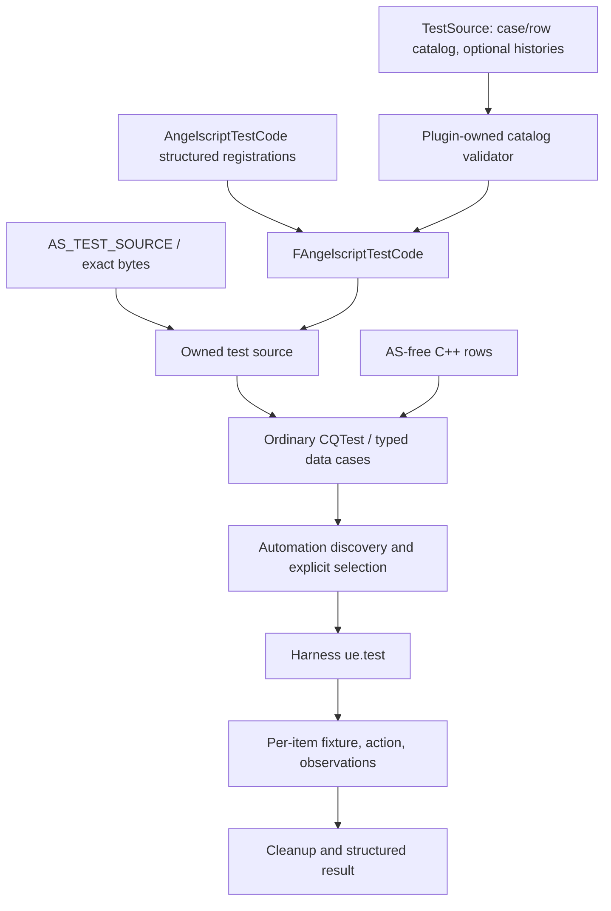

# Unified testing design

## 1. Status and authority

This is the accepted implementation design, not an implemented API inventory.
All new symbols and file locations below are **planned**. This delivery writes
only this Change. It does not modify the testing Skill, TestSource, plugin code,
generated resources, current specifications, or the current Builder implementation.

The class-level continuation of this design is
[Class contracts](attachments/data/class-contracts.md): it fixes header/source
ownership, fields, public declarations, results/errors, lifetime, dependencies
and authoring call sequences. Read it with the subsystem contracts below; it is
not an alternative architecture or an implemented header inventory.

The first future implementation slice delivers source/data infrastructure and
replacement frontend adoption. Runtime, World, cache, JIT/AOT and actual reload
execution are capability-dependent follow-on adapters. Their acceptance
boundaries are defined here, but their unavailable product APIs are not invented
as Ready implementation tasks.

## 2. Components and flow



| Owner | Responsibility | Does not own |
|---|---|---|
| `FAngelscriptTestCode` | Public source lookup, history enumeration, query, sampling and source export | Test execution, expected integer helpers, mutable engines |
| `FAngelscriptTestSourceStore` | Internal immutable source descriptors and payload storage | A second author-facing registry |
| `FAngelscriptTestSource` | Owned or shared-immutable UTF-8 payload, logical identity, content hash, origin and mapping | Borrowed temporary strings or executable AS pointers |
| `FAngelscriptTestCaseCatalog` | Stable case/row descriptors and one execution owner per test item | Duplicated source bodies or runtime outcomes |
| Data-case adapter | Typed row decoding, discovery, per-item fixture lifecycle and Automation bridge | An AS parser, engine fork, or annotation execution language |
| Run result | Actual inputs, actions, observations, cleanup and managed-run evidence | Authoring truth or an editable PASS flag in a source manifest |

Absorb the source responsibilities of `FAngelscriptTestScriptCorpus` into
TestCode. Absorb Snippet query/sample/dump behavior into that same public entry.
Do not preserve parallel TestCode/TestCorpus/Snippet public stores. Old
`ExecuteAndExpectInt`, compile and exception wrappers belong in typed consumers,
not the source center.

The concrete class split is fixed as follows; the linked class contracts contain
the full proposed declarations and file map:

| Types | Main operation and ownership |
|---|---|
| `FAngelscriptTestSourceRef`, `FAngelscriptTestError`, `FAngelscriptTestStatus`, `FAngelscriptTestSourceResult` | Exact reference plus checked errors; failed lookup cannot impersonate empty source |
| `FAngelscriptTestSource`, `FAngelscriptTestSourceOrigin` | Own immutable bytes, input transformation and origin mapping |
| `FAngelscriptTestSourceHistoryBuilder`, `FAngelscriptTestSourceHistory` | Validate a local tree and expose immutable tagged materialization |
| `FAngelscriptTestCode`, `FAngelscriptTestCodeSnapshot` | Resolve/query/sample from one pinned source release |
| `FAngelscriptTestSourceStore` | Internal tables, aliases and synchronized immutable materialization cache |
| `FAngelscriptTestSourceBundle`, `FAngelscriptTestSourceBundleSnapshot` | Compose logical files from local values and catalog references, then freeze |
| `FAngelscriptTestRow<T>`, `FAngelscriptTestRowBuildContext` | Owned typed row data, read-only catalog inputs and provider error collection |
| `FAngelscriptTestCaseCatalog`, `FAngelscriptTestCaseCatalogSnapshot` | Case/row descriptors, stable discovery and checked selection |
| `FAngelscriptDataCaseContext`, `FAngelscriptDataCase` | One row's source bundle, assertions, observations and cleanup |
| `FAngelscriptDataTestAdapter`, `TAngelscriptDataTestAdapter<TCase>` | Public Automation bridge plus typed provider/fixture binding |
| `FAngelscriptTestFrontendFixture` | Current frontend snapshot, source manager, identifiers and diagnostic capture |
| `FAngelscriptTestRunResult`, `FAngelscriptTestDiagnosticCapture`, `FAngelscriptTestReportWriter` | Own evidence beyond fixture destruction and write checked artifacts |

Source value/types are foundational. History and the catalog consume them.
SourceBundle is a composition layer over Source, History and Catalog despite its
physical placement in `Framework/Source/`; the store never depends on the bundle.

## 3. Physical ownership and release boundary

Future paths are intentionally selected now:

| Path | Future owner and content |
|---|---|
| `TestSource/` | Parent authoring root; retain existing AS locations |
| `TestSource/Catalog/` | Parent source manifests, active case manifests and admission manifests |
| `TestSource/Generation/` | Existing rules/reference inputs; retained migration sources |
| `Plugins/Angelscript/Tests/Tools/TestCode/` | Plugin Python package, CLI, JSON schemas and tool contract tests |
| `Plugins/Angelscript/Source/AngelscriptTest/NewVersion/Framework/` | Replacement-only source, catalog, fixture, data and report implementation |
| `Plugins/Angelscript/Source/AngelscriptTest/NewVersion/FrameworkTests/` | Framework self-tests with public `Angelscript.UnitTest.Framework.*` identities |
| `Plugins/Angelscript/Source/AngelscriptTest/TestCode/Generated/` | Checked-in structured TestCode registrations owned by `angelscript/refactor-test-code-structured-registration`; this Change must not replace them with shards or an aggregate |
| `Plugins/Angelscript/Source/AngelscriptTest/NewVersion/NativeEngine/` | Existing frontend tests and bounded adoption cases |
| `.agents/skills/angelscript-test/` | Current authoring guidance, promoted only as capabilities become available |

Keep source behavior out of the host project's `Source/AngelscriptProject`.
Tool code is plugin-owned so the plugin's source-resource contract is reusable.
Port the needed pure functions from the existing Python package with provenance
and their focused tests; do not copy the entire obsolete CodeGen application.
The old Python public validator becomes a thin compatibility dispatcher only
when its callers are migrated. In this first slice, delegation covers the
SourceHistory parser and admitted-history validation only. Preserve the existing
ordinary Contract V2 callers, CLI arguments and audit/strict behavior until a
separate migration owns them. Do not retain a second history algorithm.

Parent authors edit AS and metadata; plugin users consume a committed generated
release. Python is required for authoring/export, not for consuming that release.
UBT compiles generated C++ without modifying source or running a publishing step.
A parent-side `check-embedded` command regenerates to temporary storage and
byte-compares against the plugin release before builds/tests that depend on it.

Publication into the plugin is a later implementation operation. Git commits,
parent gitlink updates, integration and push retain their separate authorization
boundaries. Content digests, not parent commit IDs, identify generator inputs,
avoiding parent/plugin commit circularity.

## 4. Identities and source contracts

| Value | Meaning and policy |
|---|---|
| `SourceId` | Explicit semantic identifier, case-sensitive and independent of physical location |
| `VersionTag` | Case-sensitive author-chosen label unique inside one source tree; `root` is reserved |
| `FAngelscriptTestSourceRef` | Exactly `SourceId` and `VersionTag`; no implicit latest-version resolution |
| `LogicalPath` | Compiler-facing virtual file path, distinct from the authoring file and version label |
| `ContentHash` | SHA-256 of exact materialized payload bytes after the declared input transformation |
| `Origin` | External file, inline C++ anchor, generated rule or imported historical provenance |
| `CaseId` | Explicit semantic case name beneath the replacement Automation root |
| `RowId` | Stable named row inside a case; never a vector position |

Source and row identifiers use nonempty dot/slash-free leaf tokens when inserted
as individual Automation components; source IDs may use dotted semantic paths.
The source manifest defines explicit IDs. Legacy path-derived CaseKeys and
SourceHistory `@Tag` values are migration aliases only. Preserve existing full
`@Tag` as a SourceId on initial history admission when unambiguous; do not use
only the file basename. Reject alias ambiguity and duplicate public identities.

The public source result is `FAngelscriptTestSourceResult`: either an owned
source or a structured error containing code, source reference and context.
Callers check success before consuming the value. An unresolved ID/tag never
returns an empty successful source.

`FAngelscriptTestCode::Resolve(Ref)` performs no compilation or engine work.
`GetHistory(SourceId)` returns immutable tag/parent descriptors. Query returns a
stable ordinal ordering; sampling requires an explicit seed and count. The
runtime snapshot contains no UClass, UFunction, engine or executable AS pointers.

A source bundle maps unique logical paths to source values/references. A bundle
cannot contain two versions for one logical module slot at the same time. Files
remain separate; dependencies are never implemented by concatenating modules.

Anonymous inline source acquires a case-local identity when added under an
explicit logical filename: `CaseId/RowId/local-name` (omit RowId for ordinary
cases). Use `root` unless the caller builds a local history. Repeated anonymous
construction does not permanently publish new global registry entries. Shared
cross-test source IDs require explicit catalog authoring. Local source scope is
owned by the fixture and cannot shadow a public source ID silently.

## 5. Inline authoring and exact inputs

The public macro surface is deliberately small:

```cpp
const FAngelscriptTestSource ScriptSource = AS_TEST_SOURCE(R"AS(
    int GetValue()
    {
        return 42;
    }
    )AS");
```

| Interface | Contract |
|---|---|
| `AS_TEST_SOURCE(RawLiteral)` | Capture origin and return an owning normalized source |
| `AS_TEST_SOURCE_EXACT(Literal)` | Capture origin and retain the literal's text value without trim/dedent/newline conversion |
| `FAngelscriptTestSource::FromText(Text, Mode, Origin)` | Dynamic text; caller explicitly chooses normalized or exact-text mode |
| `FAngelscriptTestSource::FromBytes(Bytes, Origin)` | Copy length-delimited bytes without decoding, repairing or normalizing |
| `GetUtf8Bytes() const &` | Borrow a byte view from a live source owner; disallow the rvalue borrowing overload |
| Explicit text/string copy methods | Return owned converted values for APIs that require them; no implicit FString conversion |

The literal macro forwards once to ordinary functions/templates, captures the
array length rather than using a terminating-NUL scan, and captures C++ source
origin. It does not obtain an engine, compile, register a test, perform source
lookup, mutate the global catalog, or format runtime parameters into AS.
Legacy `ASTEST_AS` and `ASTEST_AS_ANSI` are not aliased to this new return type.
The old `_ANSI` output was UTF-8; no new `_ANSI` macro is introduced.

Normalized mode applies exactly this order:

1. Convert the supplied text to UTF-8 and map CRLF/CR to LF.
2. Remove at most one opening LF belonging to the raw-string envelope.
3. Remove a final whitespace-only delimiter-margin line and its preceding LF
   when that line exists. Preserve additional intentional blank lines.
4. Remove the longest identical spaces/tabs prefix shared by nonblank content
   lines. Do not equate a tab with any number of spaces. Remove that prefix from
   a blank line only when it actually has it.
5. Preserve remaining interior/trailing whitespace and record the transform map.

Do not parse AS to make this normalization language-aware. Whitespace-sensitive
multiline strings, trivia, exact EOF/newline and encoding tests use exact text or
bytes. Exact text preserves the C++ literal's value, not the physical bytes of
the C++ source file; malformed UTF-8, BOM and embedded NUL fixtures use bytes.

Empty sources are valid inputs to a compiler test. They are not the same as
lookup failure. The normalized envelope-only input has zero payload bytes.

Report logical AS line/UTF-8 byte-column precisely. Map normalized offsets back
to literal-relative coordinates. C++ file/line is an authoring anchor: a
multiline macro's `__LINE__` can refer to its closing line, so it is not a blanket
promise of exact C++ body character location. Do not read the C++ file at runtime
to manufacture a mapping. A later exact editor-navigation feature would require
its own validated source-location contract.

## 6. SourceHistory authoring and materialization

One ordinary `.as` contains a root body and child snapshots inside a trailing
comment. Retain the familiar `@Harness SourceHistory`, `@version`, `@parent`,
`@change` and `@end` authoring form. Author full snapshots, never manual diff
hunks. The source manifest supplies the stable SourceId; existing full `@Tag`
can seed it during migration. Metadata is not a second copy of the snapshots.

The new source-only form is concrete below. Root is the ordinary AS body; child
blocks are complete snapshots. The source manifest in section 8 supplies the ID.

```angelscript
/**
 * @Harness SourceHistory
 */
int GetValue()
{
    return 5;
}

/*
@version root

@version broken-type
@parent root
@change
MissingType GetValue()
{
    return 5;
}
@end

@version repaired
@parent broken-type
@change
int GetValue()
{
    return 9;
}
@end
*/
```

`@change` opens the child snapshot; `@end` closes it. It is not an operation or a
change-note field. The root marker has no parent or embedded child body. Comments
that introduce the authoring envelope are excluded from the root payload by the
single parser, with the removed regions retained in its provenance map.

New active history syntax uses source/tree markers only. A compatibility import
may read old `@compile`, `@expect`, `@retain`, `@oracle` and `@onto` into migration
notes, but they cannot silently create executable current cases. `@path`,
`@depends` and free-text oracle execution are not a new runtime DSL.

The public validator must actually parse every admitted history; it must not
merely exclude those paths from ordinary inventory. Validate one root, unique
tags, known parents, no self-parent/cycle, connected ancestry, and unambiguous
snapshot delimiters. Resolve parent order topologically rather than requiring
file declaration order. Reject malformed/unsupported marker payloads with a
location instead of silently dropping them. The v1 authoring format rejects
ambiguous embedded comment terminators and marker terminator lines in snapshots;
report the limitation explicitly and allow an exact/local C++ source fixture for
that narrow formatting case rather than silently truncating source.

History snapshots use the existing explicit LF normalization policy. Keep
authored-path and snapshot-relative mappings. The embedded representation is
root bytes plus verified parent-to-child diffs and hashes. Generate in stable
SourceId/tag order. For every child require forward reconstruction and reverse
reconstruction to agree with the authored snapshots. An identical child is
rejected as a redundant source version; observe/reanalyze the existing tag for a
no-change step. Empty text may be a real edited version; module deletion is an
execution operation, not an empty-diff convention.

The embedded diff v1 is a bounded splice table, not a runtime unified-diff text
parser. Each edit records a parent-byte offset, a removed-byte count and an
inserted-byte slice; edits are sorted by increasing parent offset and may not
overlap. A descriptor carries the expected parent and child SHA-256. Application
copies untouched parent spans and inserted bytes in order, using checked
arithmetic and explicit lengths; it validates the final hash before publication.
The emitter may derive these splices from the existing line-diff algorithm,
but byte-identical reconstruction is the contract. Reverse verification uses
the original parent spans during generation; runtime storage need not duplicate
removed text. Per-version origin maps refer to the authored complete snapshot,
so inserted text maps to its child block rather than a diff-file line.

`Resolve(SourceId, VersionTag)` reconstructs from that source's root/parent chain,
validating every expected parent and child hash. It never patches whatever
runtime source happens to be active. Cache immutable materializations by source
snapshot identity and tag; invalidate when the release/catalog digest changes.

Local C++ tests can build the same tree descriptor with ordinary
`FAngelscriptTestSourceHistoryBuilder` methods `AddRoot(Source)`,
`AddVersion(Tag, ParentTag, Source)` and checked `Build()`. Inline child snapshots
are already compiled into C++; keep those immutable full payloads rather than
adding runtime diff generation merely to mimic the external storage encoding.
Both storage forms have the same ancestry, lookup and hash contract.

## 7. Reload scenario boundary

The source graph answers which text exists. A typed C++ scenario answers which
operation runs next and what it must prove:

```text
Source ancestry: root -> broken-type -> repaired

InitialCompile(root) -> Observe initial behavior
SoftReload(broken-type) -> Expect diagnostic and unchanged last-good behavior
SoftReload(repaired) -> Observe repaired behavior and retained state
```

Future execution actions are `InitialCompile`, `Analyze`, `SoftReload`,
`FullReload`, `DeleteModule`, and `Observe`. Each action has an explicit module
slot, source reference when applicable, expected active-state precondition and
typed expected outcome. Complex object/function/property checks are C++ code.
Do not reduce the scenario to `RunEverything()` returning one bool.

Track attempted, active and last-good references separately. A failing reload
may satisfy an expected-negative step, but only a successful accepted activation
advances active/last-good. A repaired snapshot can have the failed tag as its
source parent while it is applied against the current last-good runtime. Parent
relationships never imply engine reset or successful prior activation.

For multiple modules, keep one source tree per module and explicit C++ steps:

```text
InitialCompile Provider@root
InitialCompile Consumer@root  [requires active Provider@root]
Observe existing Consumer.Entry == 11
SoftReload Provider@body-update
Observe existing Consumer.Entry == 29
```

The final observation does not recompile the consumer. If a different scenario
requires recompilation, it must explicitly request it. A source version does not
permanently require one exact runtime version of another tree.

The first slice verifies these source/data contracts without claiming actual
reload. Runtime adapter acceptance later requires soft identity retention, full
replacement, failed reload preservation, failed-then-repaired execution,
cross-module rebinding, deletion and resource cleanup against live product APIs.

## 8. Manifests, generator and embed CLI

Use small per-source and per-case JSON files, plus generated indexes. Do not make
one hand-edited global index a merge bottleneck. Source manifests contain schema
version, SourceId, authoring path, source kind, tags and explicit legacy aliases.
History tags/parents come from the AS history, not duplicated manifest snapshots.

Case manifests contain schema version, CaseId, adapter/data-schema identity,
capability requirements and named rows. Each row contains RowId, source refs with
logical paths if needed, input and expected data. The named C++ fixture owns the
row schema/codec; JSON cannot define arbitrary executable operations. Each
admitted adapter/schema pair has a checked-in, versioned JSON schema under the
plugin tool's `schemas/` and a matching compiled C++ codec. Python validates
against that schema; it does not infer or execute C++ types. Shared valid/invalid
vectors prove the two validators agree at their boundary. Exact
integer widths, floating comparison policy, container ordering and reference
identity observations belong to that schema, not an untyped universal equality.
Reject unknown adapters, incompatible schema versions and out-of-range values
before a case is executable. Do not serialize pointers or engine instances.

An admission manifest selects the active sources/cases. The remaining old corpus
stays inventoried and unverified. Strict validation targets an admitted domain;
unrelated unconverted files do not block a small valid release. The global audit
still reports missing/stale contracts honestly. Existing Contract V2 and v1
rules are migration inputs, not two authorities for active cases. Move selected
inputs/oracles into the new case owner and keep a provenance alias. Do not require
an execution vector for every incidental AS helper, constructor or destructor.

For the history above, the proposed v1 source record is
`TestSource/Catalog/sources/framework-tagged-value.json`:

```json
{
  "schemaVersion": 1,
  "sourceId": "Framework.History.TaggedValue",
  "authoringPath": "Framework/TaggedValue.as",
  "kind": "history",
  "logicalPath": "TaggedValue.as",
  "tags": ["framework", "history"],
  "aliases": []
}
```

Authoring paths are relative to TestSource. `kind` is one of `text`, `bytes`, or
`history`. Text inputs declare `textMode` as `normalized` or `exact`; bytes have
no text mode, and history uses its defined LF policy. Manifest `tags` are query
labels; VersionTags and parents are parsed exclusively from the AS history.
Ordinary text/bytes supply only `root`. No source record contains a PASS flag.

A corresponding case record shows the data boundary without pretending to
execute reload, at `TestSource/Catalog/cases/framework-tagged-value.json`:

```json
{
  "schemaVersion": 1,
  "caseId": "Angelscript.UnitTest.Framework.History.TaggedSource",
  "adapterId": "Framework.HistoryDescriptor",
  "dataSchema": {"id": "HistoryDescriptorRow", "version": 1},
  "capabilities": [],
  "rows": [
    {
      "rowId": "RepairHasFailedSourceParent",
      "sources": [
        {
          "logicalPath": "TaggedValue.as",
          "source": {
            "sourceId": "Framework.History.TaggedValue",
            "versionTag": "repaired"
          }
        }
      ],
      "input": {"logicalPath": "TaggedValue.as"},
      "expected": {"parentTag": "broken-type"}
    }
  ]
}
```

This adapter/schema pair is a planned framework pilot: its codec produces typed
logical-path and expected-parent fields; the C++ fixture queries the selected
history descriptor and asserts its parent. It proves ancestry only. A row's
optional `capabilities` list adds to its case list; each entry has `capabilityId`
and `required`. Source-free schemas may omit `sources`. Additional adapter-owned
input/expected fields require a schema version, not arbitrary runtime commands.

The explicit pilot selection at
`TestSource/Catalog/selections/framework-pilot.json` uses the same identities:

```json
{
  "schemaVersion": 1,
  "sources": ["Framework.History.TaggedValue"],
  "cases": ["Angelscript.UnitTest.Framework.History.TaggedSource"]
}
```

Every selected case source must belong to the explicit selected source set; the
tool diagnoses missing closure rather than silently widening admission. Selecting
a history admits its validated tree. Optional row narrowing selects explicit
case/row pairs at execution; it does not change the source release implicitly.
Unknown record fields fail strict validation unless an owned schema declares
them. These examples fix the wire shape; tasks 2.2/2.3 establish the actual schemas
and validators before any manifest is published.

The plugin-owned CLI is `python Plugins/Angelscript/Tests/Tools/TestCode/test_code.py`
with these subcommands:

| Command | Inputs / outputs |
|---|---|
| `audit --root TestSource` | Read-only inventory and diagnostics; nonzero for invalid/missing migration contracts |
| `validate --root TestSource --selection <manifest>` | Strict structural/admission/source checks; no AS compile claim |
| `emit-cpp` / `check-embedded` | Withdrawn. Checked-in TestCode originals are structured registrations, not shard/aggregate releases |
| `generate --recipe <id> --seed <u64> --count <n> --output <directory>` | Bounded source/case generation with reproducible provenance |

All outputs are UTF-8; JSON projections use deterministic key/array ordering as
appropriate to their semantic order. Input fingerprints bind schema version,
tool version, selected metadata, logical paths and payload/diff bytes. Exclude
absolute workspace paths, timestamps and Git parent commits from generated
identity. Output filenames derive from stable logical groups, not machine paths.
Do not publish a competing TestCode shard/aggregate release. Checked-in
AngelScript originals remain one mirrored structured registration per `.as`,
owned by `angelscript/refactor-test-code-structured-registration`. This Change
may validate TestSource case/row admission and consume that database. Avoid
per-consumer ForceLink calls and static engine initialization.

Use the existing SplitMix64-v1 recipe semantics where adopted, with fixed golden
vectors. Identity includes recipe/version, named axes and seed. A generator
supplies input and an independently justified oracle, not expected values
obtained by rerunning the same implementation under test. Enumeration is bounded
by explicit rows/seeds/count; no implicit Cartesian explosion. Failure captures
the complete generated source and parameters. Admission of a saved failure as a
permanent regression is explicit; long-running fuzzing/reduction is deferred.

## 9. Typed cases and Automation registration

Keep ordinary CQTest unchanged. The new macro is:

```cpp
AS_REGISTER_DATA_TEST(RegistrationToken, PublicCasePath, CaseType, Provider, Flags);
```

`CaseType` derives from `FAngelscriptDataCase`, exposes its nested `FRow` to the
adapter, and implements `void Run(const FRow&)`. `Provider` takes
`FAngelscriptTestRowBuildContext& Build` and returns owned
`TArray<FAngelscriptTestRow<CaseType::FRow>>`; the wrapper owns RowId, typed Data
and optional source/capability metadata. Providers are static/pure descriptor
construction apart from appending structured errors to Build; its catalog view
is read-only and it contains no mutable run state. Providers must not create
mutable engine/World state. File-backed rows
are decoded once into the same typed shape by the named schema codec.

`FAngelscriptDataCase` owns an `FNoDiscardAsserter Assert` bound to the current
Automation test, so `ASSERT_THAT` is valid in its member `Run` method. That macro
uses `this->Assert`; do not document it as a free matcher or use it unchanged in
a free callback. Keep `Setup()` and `TearDown()` as explicit fixture hooks. The
adapter creates a fresh case instance per selected row, invokes setup/run, and
ensures teardown and registered RAII cleanup after ordinary early return.

The data adapter derives from the public `FAutomationTestBase` bridge surface.
It does not alter UE CQTest or use private `_TEST_CLASS_IMPL` machinery. One
registration object owns a case family; `GetTests` enumerates the rows and
`RunTest` resolves one stable selection token. Large source/data payloads stay in
the immutable catalog, not Automation command strings.

Keep existing ordinary test names unchanged. Data names are
`<PublicCasePath>.Rows.<RowId>`; PublicCasePath starts with
`Angelscript.UnitTest.`. `Rows` is the reserved row suffix so ordinary scenario
names and row names cannot collide accidentally. Named matrix axes belong in
the stable RowId; the caller cannot derive it from list order. A catalog
generation/digest travels with internal selection so stale discovery is rejected.

The common inspection view may include ordinary CQTest metadata, but CQTest
remains its sole registration/execution owner. Do not register a second copy of
an ordinary method in the data bridge.

Duplicate IDs, unknown selection, invalid rows and empty providers are errors.
Because Automation's GetTests cannot return an error, a registered family whose
provider/admission fails exposes one reserved `.Rows.CatalogError` diagnostic
item. Running it reports the structured catalog errors and fails without
constructing a case fixture. Authors cannot use CatalogError as a RowId. Valid
families expose only their actual rows, and this item never counts as user
behavior coverage.
If a filter selects zero executable items, report an empty selection rather than
a successful test run. Explicit optional capability exclusions remain visible;
missing required capabilities fail selection/setup. No Info-skip-as-PASS rule.

The first bridge uses discovery-time exclusions. A declared optional requirement
is the explicit policy permitting exclusion when that capability is absent;
record the excluded CaseId/RowId, capability and reason in the catalog's
selection report, then omit that row from GetTests. Required-unavailable rows
remain discoverable and fail their diagnostic branch without a fixture. A
direct token for an excluded row fails selection; it never executes secretly.
Write the exclusion projection with the discovery report when an artifact root
is available, including when no executable row remains. Use the existing Harness
empty-report Incomplete handling for zero execution. Do not use UE's global
excludelist to manufacture native Skipped rows: Harness can report an all-skipped
nonempty report as PassedWithWarnings. Mixed-prefix filtering does not establish
which omitted row a user intended to select; only an explicit token/exact empty
selection supports that narrower diagnostic claim.

## 10. Fixtures, assertions and results

Separate the layers a test proves:

| Layer | First-slice execution |
|---|---|
| Framework source/catalog/history/generator contracts | Focused Python and replacement C++ Automation |
| Frontend source/lexer/preprocessing/AST/diagnostics/semantic phases | Current public frontend interfaces, local snapshots and observations |
| Runtime execution/cache/JIT/AOT | Deferred until corresponding product capability exists |
| UE bindings/reflection/World/Blueprint/GC/latent | Deferred adapter-specific capability |
| Runtime reload and multi-module lifecycle | Deferred; source-history infrastructure can be verified now |

NativeEngine currently means isolation from the legacy AS engine, not a
UE-independent executable. Consolidate source-bundle/snapshot construction and
phase setup under a replacement frontend fixture. Keep assertions about actual
AST nodes, declaration identity and other observables in the scenario method.
Use the real typed diagnostic record/collecting consumer; do not promote the
minimal old string-only capture into a competing diagnostic system.

Unit/data fixtures own snapshots and observations. No shared mutable engine pool
is introduced. Later resource-heavy fixtures acquire explicit per-item leases;
read-only input reuse is allowed. Timeouts/cancellation finish managed cleanup
where the process survives. Crashes are reported by the managed process; do not
claim in-process teardown ran after a fatal crash. Hazardous subprocess tests
remain separately selected.

`FAngelscriptTestRunResult` records CaseId, RowId, source refs and payload hashes,
case/catalog/schema/generator identity, seed/axes, build identity, adapter,
capability decision, per-phase observations, cleanup result, duration, and
Harness command/RunId/report correlation when supplied by actual managed-run
metadata. Exact typed diagnostics retain ID,
severity, primary/related ranges, arguments and fix-its. Message text equality
is reserved for rendering contracts. Comparisons report the failing field and
expected/actual values rather than one aggregate AS boolean.

Execution outcomes distinguish Passed, Failed, Skipped, Unavailable, Cancelled,
TimedOut and Crashed. Corpus stages independently distinguish inventoried,
structurally validated, compiled, executed and externally observed; absence of
fresh evidence is unverified. A negative compile case passes only after actual
compilation fails as expected with matching diagnostics. It does not gain runtime
coverage. Required-unavailable and empty selections cannot make the run green.

The existing Harness test routes pass UE's `-ReportExportPath`; use that explicit
directory as the artifact root and allocate collision-resistant per-item
subdirectories beneath `Angelscript/`. The artifact writer accepts a resolved
output context; it does not guess a RunId from folder names, modify Harness run
metadata, or require a new Harness argument. The managed report path correlates
the item with the externally recorded command and RunId. Interactive/no-report
execution uses a unique local `Saved/AngelscriptTests/` invocation directory,
explicitly marked uncorrelated; it never fabricates managed evidence.

Failure artifacts include complete materialized source, tree/tag, attempted
versus active state when applicable, parameters, diagnostics and reproduction
selection. Resolve filenames below the allocated root without using raw
SourceId/RowId as filesystem paths; reject traversal and report write failures.
Do not write a PASS status back into authored source contracts. A content change
invalidates the applicability of old evidence without deleting the historical
result.

## 11. Authoring Skill consolidation

The Skill update is a future task, not performed by this planning delivery.
Preserve current replacement instructions and the user's unrelated edits.

Current authoring rules belong at the entry, not below a legacy heading:

- Do not create an anonymous namespace solely for one CQTest class.
- Keep class-only constants, observations and narrow helpers inside that class,
  normally private; expose types/entry points only when the adapter needs them.
- Restore public visibility before CQTest hooks and test methods.
- Show setup, action, observation and assertion in the scenario; helpers remove
  incidental preparation, not the whole meaning of the test.
- Do not create file-level TestTrue/TestEqual assertion aliases or ignore helper
  return values. Put genuinely shared support in focused support files.
- Local AS uses readable Allman formatting and scenario-specific variable names.
  Shared sources may be external; AS-free C++ tests remain ordinary tests.

`SKILL.md` owns the short current route, baseline, correct CQTest name composition
and Harness verification entry. Focused references own case authoring, inline
source, TestCode, SourceHistory and legacy isolation. The Chinese Skill becomes
navigation to the English authority. Existing long CQTest notes are historical,
not alternate execution instructions. Correct the known archived quarantine
script link and plain-text old Tools/Documents routes as well as Markdown links.

`Documents/UnitTest/UnitTest.md` and its inline-format reference supply useful
writing principles, not current compile gates, runtime lifecycle or runner
authority. Do not copy their old WITH_ANGELSCRIPT_UNITTESTS-only policy or shared
engine template into the replacement guide. Do not rewrite those Documents in
this Change merely to create another policy copy.

The initial future Skill cleanup documents only available behavior and links
this design for planned APIs. Promote AS_TEST_SOURCE, row registration and
TestCode examples only after their owning implementation nodes and real examples
pass. Retain future runtime/reload examples as explicitly unavailable design
examples until the corresponding product adapter exists.

## 12. Adoption, verification and deferred boundaries

Admit small representative sources and cases first: AS-free row data, inline
normal/exact inputs, a shared external source, one branched history, a real lexer
diagnostic and deterministic generated input. Existing thousands of files remain
reference/unverified until their observation contracts and capability match.
Do not mass-convert old v1/V2 rules into claimed executable coverage, create
Theme2 mirrors, or cherry-pick the old runtime/framework wholesale.

Tool tests prove source/model/export contracts. C++ changes require a fresh
Harness Editor build followed by the exact relevant prefix with Fast enabled.
One prefix executes in one managed process where practical; each row still has
its own fixture. Broaden only for shared-contract impact or observed failures.
Do not add unconditional Quick/Performance/Integration/full-UE gates.

Coordination with Builder work is read-only here. During future adapter adoption,
use that workspace's settled public stage interfaces and keep fixture ownership
disjoint from language implementation tasks. A task cannot claim execution
support just because detached metadata or registration is available.

The source format's known comment-delimiter limitation, the new source-object
return type, explicit local identities, and plugin/parent generated-release
coupling are accepted tradeoffs. No automatic legacy fallback is provided.
Roll back a future pilot by removing its admission/registration while retaining
the existing ordinary tests and generated release consistency; never reactivate
Legacy to mask a failed replacement check.
